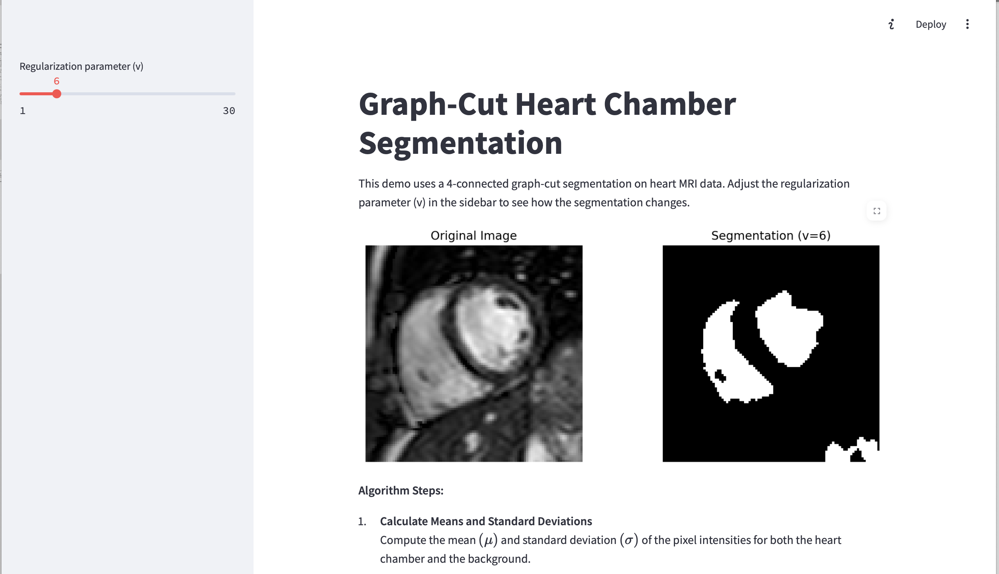

# Graph-Cut Heart Chamber Segmentation

## Project Overview

This project demonstrates **heart chamber segmentation** using a **graph-cut** algorithm. The image data (`heart_data.mat`) contains intensity samples for both the **chamber** and **background**, as well as a 2D heart image (`im`). You can adjust the **regularization parameter** \(v\), to can control how strongly the segmentation enforces spatial smoothness.

## Technologies Used

- **Python** (NumPy, SciPy): Main language and libraries for the algorithm
- **Streamlit**: For UI and Frontend
- **Matplotlib**: for for plotting and displaying images

## Segmentation Screenshot

Below is an example screenshot from the Streamlit app, showing the **original image** on the left and the **segmentation mask** on the right.

